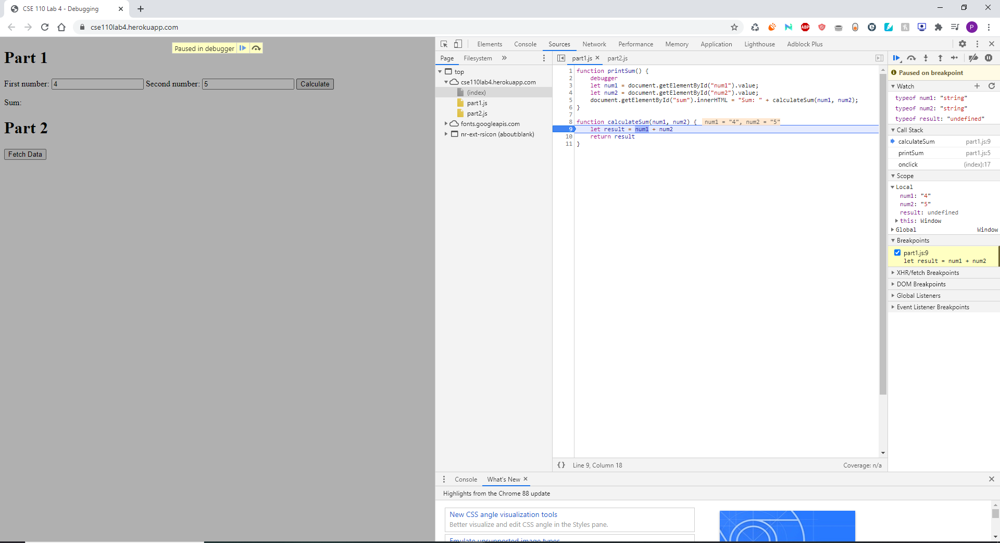
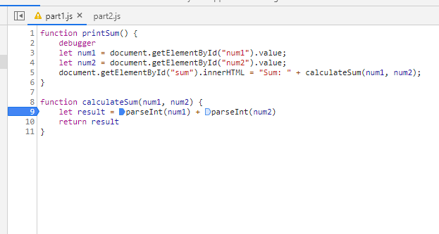

<h6> Watches and breakpoints </h6>

<h6> What was the bug? </h6>
The bug was the num1 and num2 variables were being read as strings, not integers  

<h6> How would you fix it? Include a screenshot of your fix. </h6>
The easiest way to fix it would be to convert the string into an integer with parseInt as I did below:  

